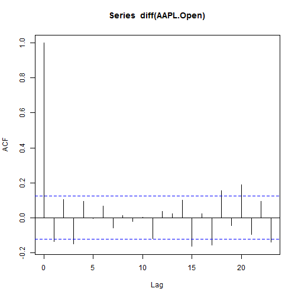

Examples for some financal packages
========================================================

Here are some examples about the packages applied in financal 

金融数据读取
----------------
package：fImport，quantmod  
对于fImport，可以从research.stlouisfed.org，www.oanda.com，chart.yahoo.com下载金融数据，可以分别返回Timesereses和fwebdata类型的数据  

```r
require(fImport)
```

```
## Loading required package: fImport
```

```
## Loading required package: timeDate
```

```
## Loading required package: timeSeries
```

```r
X <- yahooSeries("AAPL")  #从yahoo下载苹果股价指数，返回的是timeserises类型
str(X)  #timesereise类型是什么？
```

```
## Time Series:          
##  Name:               object
## Data Matrix:        
##  Dimension:          250 6
##  Column Names:       AAPL.Open AAPL.High AAPL.Low AAPL.Close AAPL.Volume AAPL.Adj.Close
##  Row Names:          2013-05-07  ...  2012-05-08
## Positions:          
##  Start:              2012-05-08
##  End:                2013-05-07
## With:               
##  Format:             %Y-%m-%d
##  FinCenter:          GMT
##  Units:              AAPL.Open AAPL.High AAPL.Low AAPL.Close AAPL.Volume AAPL.Adj.Close
##  Title:              Time Series Object
##  Documentation:      Wed May 08 13:56:05 2013
```

数据类型
---------------
package：timeseries，zoo   
主要是提供不同数据类型的一些基本处理方法

```r
library(timeSeries)
by <- timeSequence(from = start(X), to = end(X), by = "week")
aggregate(X, by, mean)  #每周的平均值
```

```
## GMT
##            AAPL.Open AAPL.High AAPL.Low AAPL.Close AAPL.Volume
## 2012-05-08     569.6     571.5    558.7      568.2    17759000
## 2012-05-15     565.5     571.0    560.6      563.6    14588660
## 2012-05-22     547.5     556.6    536.0      545.0    23831320
## 2012-05-29     567.2     572.3    559.6      567.6    15983425
## 2012-06-05     568.4     573.6    561.1      569.0    17766440
## 2012-06-12     575.8     579.4    568.5      574.2    15395600
## 2012-06-19     574.2     580.9    572.1      578.2    12687320
## 2012-06-26     580.3     582.8    574.3      577.7    11076320
## 2012-07-03     580.9     585.6    577.9      583.9    11065280
## 2012-07-10     607.7     614.1    602.7      609.5    16023900
## 2012-07-17     605.0     608.3    599.6      604.4    12883400
## 2012-07-24     606.5     610.7    599.9      605.9    15286720
## 2012-07-31     584.7     591.6    580.5      588.2    18066800
## 2012-08-07     614.5     619.0    609.6      614.8    11815220
## 2012-08-14     622.2     627.2    621.4      624.8     9144920
## 2012-08-21     644.7     651.8    639.5      647.3    17005300
## 2012-08-28     667.0     673.1    661.8      669.0    15122980
## 2012-09-04     669.7     673.2    664.3      669.4    10818925
## 2012-09-11     674.5     678.1    667.0      670.1    14637280
## 2012-09-18     686.7     690.9    681.9      689.1    19161440
## 2012-09-25     695.4     699.4    689.7      693.0    17097060
## 2012-10-02     668.9     675.8    659.1      666.9    20552080
## 2012-10-09     657.4     660.0    647.8      653.0    20468600
## 2012-10-16     636.7     642.6    629.0      636.7    17848040
## 2012-10-23     632.6     639.2    621.2      626.9    20454460
## 2012-10-30     617.0     620.9    602.4      610.1    26586733
## 2012-11-06     592.5     596.1    582.9      587.2    16962340
## 2012-11-13     553.6     559.3    540.0      545.7    27346140
## 2012-11-20     544.2     551.3    531.8      543.4    28571760
## 2012-11-27     574.2     579.9    568.3      576.9    16158375
## 2012-12-04     585.9     589.0    579.6      583.9    16773080
## 2012-12-11     543.2     553.2    529.3      538.1    30226580
## 2012-12-18     525.5     531.7    517.8      526.2    25037680
## 2012-12-25     523.6     527.0    518.3      521.9    15206075
## 2013-01-01     513.3     521.4    508.2      517.5    15815425
## 2013-01-08     538.0     540.9    529.0      533.5    17504860
## 2013-01-15     514.6     517.1    506.5      509.7    21215980
## 2013-01-22     502.0     507.6    496.9      503.4    18562075
## 2013-01-29     463.4     470.1    455.6      462.5    34907600
## 2013-02-05     454.2     459.4    448.4      453.2    16617420
## 2013-02-12     469.9     476.5    463.2      469.7    21842780
## 2013-02-19     465.4     469.5    460.3      463.4    14803675
## 2013-02-26     450.1     453.0    443.7      447.5    15201560
## 2013-03-05     436.0     440.4    430.4      433.5    19167880
## 2013-03-12     430.8     436.1    425.4      430.9    16145380
## 2013-03-19     440.0     446.4    436.6      442.9    17759700
## 2013-03-26     458.5     462.7    455.0      458.3    13446080
## 2013-04-02     443.9     447.6    436.6      438.4    15119000
## 2013-04-09     428.2     430.6    424.1      427.2    12229160
## 2013-04-16     428.9     432.7    425.3      429.2    11174780
## 2013-04-23     402.0     407.3    392.6      398.0    23580660
## 2013-04-30     414.0     425.4    412.0      420.8    24633560
## 2013-05-07     451.6     454.9    446.4      450.8    16202460
##            AAPL.Adj.Close
## 2012-05-08          559.9
## 2012-05-15          555.4
## 2012-05-22          537.0
## 2012-05-29          559.4
## 2012-06-05          560.7
## 2012-06-12          565.8
## 2012-06-19          569.8
## 2012-06-26          569.3
## 2012-07-03          575.4
## 2012-07-10          600.6
## 2012-07-17          595.6
## 2012-07-24          597.1
## 2012-07-31          579.6
## 2012-08-07          605.8
## 2012-08-14          617.8
## 2012-08-21          640.6
## 2012-08-28          662.1
## 2012-09-04          662.5
## 2012-09-11          663.1
## 2012-09-18          682.0
## 2012-09-25          685.9
## 2012-10-02          660.0
## 2012-10-09          646.2
## 2012-10-16          630.1
## 2012-10-23          620.4
## 2012-10-30          603.8
## 2012-11-06          581.2
## 2012-11-13          542.5
## 2012-11-20          540.2
## 2012-11-27          573.5
## 2012-12-04          580.5
## 2012-12-11          535.0
## 2012-12-18          523.2
## 2012-12-25          518.9
## 2013-01-01          514.5
## 2013-01-08          530.4
## 2013-01-15          506.8
## 2013-01-22          500.5
## 2013-01-29          459.8
## 2013-02-05          450.6
## 2013-02-12          469.1
## 2013-02-19          463.4
## 2013-02-26          447.5
## 2013-03-05          433.5
## 2013-03-12          430.9
## 2013-03-19          442.9
## 2013-03-26          458.3
## 2013-04-02          438.4
## 2013-04-09          427.2
## 2013-04-16          429.2
## 2013-04-23          398.0
## 2013-04-30          420.8
## 2013-05-07          450.8
```

```r
AAPL.Open <- X[, "AAPL.Open"]
AAPL.Open <- as.ts(AAPL.Open)
acf(diff(AAPL.Open))
```

 

```r
y <- diff(AAPL.Open)
y = y - mean(y)  # de-mean (set mean to zero)
library(fGarch)
```

```
## Loading required package: fBasics
```

```
## Loading required package: MASS
```

```
## Attaching package: 'fBasics'
```

```
## The following object is masked from 'package:base':
## 
## norm
```

```r
garchFit(~garch(1, 0), data = y, include.mean = FALSE)
```

```
## 
## Series Initialization:
##  ARMA Model:                arma
##  Formula Mean:              ~ arma(0, 0)
##  GARCH Model:               garch
##  Formula Variance:          ~ garch(1, 0)
##  ARMA Order:                0 0
##  Max ARMA Order:            0
##  GARCH Order:               1 0
##  Max GARCH Order:           1
##  Maximum Order:             1
##  Conditional Dist:          norm
##  h.start:                   2
##  llh.start:                 1
##  Length of Series:          249
##  Recursion Init:            mci
##  Series Scale:              11.33
## 
## Parameter Initialization:
##  Initial Parameters:          $params
##  Limits of Transformations:   $U, $V
##  Which Parameters are Fixed?  $includes
##  Parameter Matrix:
##                     U         V params includes
##     mu     -2.812e-17 2.812e-17    0.0    FALSE
##     omega   1.000e-06 1.000e+02    0.1     TRUE
##     alpha1  1.000e-08 1.000e+00    0.1     TRUE
##     gamma1 -1.000e+00 1.000e+00    0.1    FALSE
##     delta   0.000e+00 2.000e+00    2.0    FALSE
##     skew    1.000e-01 1.000e+01    1.0    FALSE
##     shape   1.000e+00 1.000e+01    4.0    FALSE
##  Index List of Parameters to be Optimized:
##  omega alpha1 
##      2      3 
##  Persistence:                  0.1 
## 
## 
## --- START OF TRACE ---
## Selected Algorithm: nlminb 
## 
## R coded nlminb Solver: 
## 
##   0:     770.27909: 0.100000 0.100000
##   1:     357.81483:  1.03774 0.447340
##   2:     354.64475:  1.18825 1.00000e-08
##   3:     354.56795:  1.09912 0.183584
##   4:     353.67625:  1.08582 0.137843
##   5:     352.57221: 0.941020 0.0139860
##   6:     351.19795: 0.867753 0.164367
##   7:     351.17465: 0.836835 0.171190
##   8:     351.17097: 0.845917 0.167916
##   9:     351.17089: 0.846024 0.167201
##  10:     351.17085: 0.846351 0.166273
##  11:     351.17085: 0.846358 0.166276
## 
## Final Estimate of the Negative LLH:
##  LLH:  955.6    norm LLH:  3.838 
##    omega   alpha1 
## 108.6650   0.1663 
## 
## R-optimhess Difference Approximated Hessian Matrix:
##            omega    alpha1
## omega  -0.008247   -0.6542
## alpha1 -0.654191 -126.0534
## attr(,"time")
## Time difference of 0.003 secs
## 
## --- END OF TRACE ---
## 
## 
## Time to Estimate Parameters:
##  Time difference of 0.025 secs
```

```
## 
## Title:
##  GARCH Modelling 
## 
## Call:
##  garchFit(formula = ~garch(1, 0), data = y, include.mean = FALSE) 
## 
## Mean and Variance Equation:
##  data ~ garch(1, 0)
## <environment: 0x0430c198>
##  [data = y]
## 
## Conditional Distribution:
##  norm 
## 
## Coefficient(s):
##     omega     alpha1  
## 108.66504    0.16628  
## 
## Std. Errors:
##  based on Hessian 
## 
## Error Analysis:
##         Estimate  Std. Error  t value Pr(>|t|)    
## omega   108.6650     14.3571    7.569 3.77e-14 ***
## alpha1    0.1663      0.1161    1.432    0.152    
## ---
## Signif. codes:  0 '***' 0.001 '**' 0.01 '*' 0.05 '.' 0.1 ' ' 1
## 
## Log Likelihood:
##  -955.6    normalized:  -3.838 
## 
## Description:
##  Wed May 08 13:56:06 2013 by user: CFCINDEX
```

```r
garchFit(~garch(4, 0), data = y, include.mean = FALSE)
```

```
## 
## Series Initialization:
##  ARMA Model:                arma
##  Formula Mean:              ~ arma(0, 0)
##  GARCH Model:               garch
##  Formula Variance:          ~ garch(4, 0)
##  ARMA Order:                0 0
##  Max ARMA Order:            0
##  GARCH Order:               4 0
##  Max GARCH Order:           4
##  Maximum Order:             4
##  Conditional Dist:          norm
##  h.start:                   5
##  llh.start:                 1
##  Length of Series:          249
##  Recursion Init:            mci
##  Series Scale:              11.33
## 
## Parameter Initialization:
##  Initial Parameters:          $params
##  Limits of Transformations:   $U, $V
##  Which Parameters are Fixed?  $includes
##  Parameter Matrix:
##                     U         V params includes
##     mu     -2.812e-17 2.812e-17  0.000    FALSE
##     omega   1.000e-06 1.000e+02  0.100     TRUE
##     alpha1  1.000e-08 1.000e+00  0.025     TRUE
##     alpha2  1.000e-08 1.000e+00  0.025     TRUE
##     alpha3  1.000e-08 1.000e+00  0.025     TRUE
##     alpha4  1.000e-08 1.000e+00  0.025     TRUE
##     gamma1 -1.000e+00 1.000e+00  0.100    FALSE
##     gamma2 -1.000e+00 1.000e+00  0.100    FALSE
##     gamma3 -1.000e+00 1.000e+00  0.100    FALSE
##     gamma4 -1.000e+00 1.000e+00  0.100    FALSE
##     delta   0.000e+00 2.000e+00  2.000    FALSE
##     skew    1.000e-01 1.000e+01  1.000    FALSE
##     shape   1.000e+00 1.000e+01  4.000    FALSE
##  Index List of Parameters to be Optimized:
##  omega alpha1 alpha2 alpha3 alpha4 
##      2      3      4      5      6 
##  Persistence:                  0.1 
## 
## 
## --- START OF TRACE ---
## Selected Algorithm: nlminb 
## 
## R coded nlminb Solver: 
## 
##   0:     677.19856: 0.100000 0.0250000 0.0250000 0.0250000 0.0250000
##   1:     375.27412: 0.692858 0.402263 0.413364 0.514108 0.365791
##   2:     363.67512:  1.00713 1.00000e-08 1.00000e-08  1.00000 1.00000e-08
##   3:     362.82616: 0.981708 1.00000e-08 1.00000e-08  1.00000 1.00000e-08
##   4:     355.33216: 0.730286 1.00000e-08 1.00000e-08  1.00000 1.00000e-08
##   5:     353.41090: 0.673688 1.00000e-08 1.00000e-08 0.960204 1.00000e-08
##   6:     350.15091: 0.571674 0.0404229 1.00000e-08 0.875897 1.00000e-08
##   7:     349.11808: 0.288726 0.312518 1.00000e-08 0.485665 1.00000e-08
##   8:     349.00156: 0.446299 0.329830 0.0631136 0.511701 0.0610624
##   9:     346.06495: 0.417253 0.274483 0.0221138 0.495965 0.0106236
##  10:     345.67210: 0.416200 0.250785 1.00000e-08 0.482082 1.00000e-08
##  11:     345.43404: 0.452800 0.240377 1.00000e-08 0.477444 1.00000e-08
##  12:     345.21608: 0.473270 0.178219 1.00000e-08 0.437505 1.00000e-08
##  13:     345.21463: 0.496660 0.215172 1.00000e-08 0.374539 1.00000e-08
##  14:     345.18583: 0.481942 0.195437 1.00000e-08 0.403920 1.00000e-08
##  15:     345.13969: 0.494048 0.196728 0.00813144 0.408692 1.00000e-08
##  16:     345.12065: 0.498655 0.184386 0.000168948 0.408248 1.00000e-08
##  17:     345.10983: 0.501798 0.165443 0.0220873 0.398278 1.00000e-08
##  18:     345.10478: 0.524379 0.169191 0.00534370 0.410286 1.00000e-08
##  19:     345.09647: 0.519737 0.166057 0.00279420 0.407785 1.00000e-08
##  20:     345.09403: 0.516619 0.168151 0.00823102 0.407104 1.00000e-08
##  21:     345.09216: 0.514437 0.164868 0.0103566 0.402198 1.00000e-08
##  22:     345.09190: 0.518332 0.160141 0.0121208 0.400328 1.00000e-08
##  23:     345.09175: 0.516475 0.161776 0.0112995 0.403141 1.00000e-08
##  24:     345.09172: 0.516803 0.162305 0.0111140 0.402338 1.00000e-08
##  25:     345.09171: 0.516886 0.162108 0.0111928 0.402076 1.00000e-08
##  26:     345.09171: 0.516866 0.162142 0.0111749 0.402107 1.00000e-08
##  27:     345.09171: 0.516868 0.162140 0.0111757 0.402107 1.00000e-08
## 
## Final Estimate of the Negative LLH:
##  LLH:  949.5    norm LLH:  3.813 
##     omega    alpha1    alpha2    alpha3    alpha4 
## 6.636e+01 1.621e-01 1.118e-02 4.021e-01 1.000e-08 
## 
## R-optimhess Difference Approximated Hessian Matrix:
##           omega    alpha1   alpha2   alpha3    alpha4
## omega  -0.01145   -0.8183   -1.049  -0.5766    -1.245
## alpha1 -0.81826 -150.1873 -147.890 -45.0552  -149.366
## alpha2 -1.04851 -147.8904 -283.569 -80.0344  -105.122
## alpha3 -0.57658  -45.0552  -80.034 -80.4733   -63.641
## alpha4 -1.24500 -149.3664 -105.122 -63.6412 -1044.918
## attr(,"time")
## Time difference of 0.025 secs
## 
## --- END OF TRACE ---
## 
## 
## Time to Estimate Parameters:
##  Time difference of 0.08201 secs
```

```
## 
## Title:
##  GARCH Modelling 
## 
## Call:
##  garchFit(formula = ~garch(4, 0), data = y, include.mean = FALSE) 
## 
## Mean and Variance Equation:
##  data ~ garch(4, 0)
## <environment: 0x040415b4>
##  [data = y]
## 
## Conditional Distribution:
##  norm 
## 
## Coefficient(s):
##      omega      alpha1      alpha2      alpha3      alpha4  
## 6.6361e+01  1.6214e-01  1.1176e-02  4.0211e-01  1.0000e-08  
## 
## Std. Errors:
##  based on Hessian 
## 
## Error Analysis:
##         Estimate  Std. Error  t value Pr(>|t|)    
## omega  6.636e+01   1.391e+01    4.770 1.84e-06 ***
## alpha1 1.621e-01   1.315e-01    1.233  0.21751    
## alpha2 1.118e-02   9.346e-02    0.120  0.90482    
## alpha3 4.021e-01   1.464e-01    2.747  0.00601 ** 
## alpha4 1.000e-08   3.444e-02    0.000  1.00000    
## ---
## Signif. codes:  0 '***' 0.001 '**' 0.01 '*' 0.05 '.' 0.1 ' ' 1
## 
## Log Likelihood:
##  -949.5    normalized:  -3.813 
## 
## Description:
##  Wed May 08 13:56:06 2013 by user: CFCINDEX
```

```r
garchFit(~garch(4, 1), data = y, include.mean = FALSE)
```

```
## 
## Series Initialization:
##  ARMA Model:                arma
##  Formula Mean:              ~ arma(0, 0)
##  GARCH Model:               garch
##  Formula Variance:          ~ garch(4, 1)
##  ARMA Order:                0 0
##  Max ARMA Order:            0
##  GARCH Order:               4 1
##  Max GARCH Order:           4
##  Maximum Order:             4
##  Conditional Dist:          norm
##  h.start:                   5
##  llh.start:                 1
##  Length of Series:          249
##  Recursion Init:            mci
##  Series Scale:              11.33
## 
## Parameter Initialization:
##  Initial Parameters:          $params
##  Limits of Transformations:   $U, $V
##  Which Parameters are Fixed?  $includes
##  Parameter Matrix:
##                     U         V params includes
##     mu     -2.812e-17 2.812e-17  0.000    FALSE
##     omega   1.000e-06 1.000e+02  0.100     TRUE
##     alpha1  1.000e-08 1.000e+00  0.025     TRUE
##     alpha2  1.000e-08 1.000e+00  0.025     TRUE
##     alpha3  1.000e-08 1.000e+00  0.025     TRUE
##     alpha4  1.000e-08 1.000e+00  0.025     TRUE
##     gamma1 -1.000e+00 1.000e+00  0.100    FALSE
##     gamma2 -1.000e+00 1.000e+00  0.100    FALSE
##     gamma3 -1.000e+00 1.000e+00  0.100    FALSE
##     gamma4 -1.000e+00 1.000e+00  0.100    FALSE
##     beta1   1.000e-08 1.000e+00  0.800     TRUE
##     delta   0.000e+00 2.000e+00  2.000    FALSE
##     skew    1.000e-01 1.000e+01  1.000    FALSE
##     shape   1.000e+00 1.000e+01  4.000    FALSE
##  Index List of Parameters to be Optimized:
##  omega alpha1 alpha2 alpha3 alpha4  beta1 
##      2      3      4      5      6     11 
##  Persistence:                  0.9 
## 
## 
## --- START OF TRACE ---
## Selected Algorithm: nlminb 
## 
## R coded nlminb Solver: 
## 
##   0:     351.39434: 0.100000 0.0250000 0.0250000 0.0250000 0.0250000 0.800000
##   1:     351.09157: 0.105045 0.0309813 0.0307746 0.0270239 0.0201755 0.804139
##   2:     350.48686: 0.103027 0.0307054 0.0303515 0.0230981 0.00961324 0.801350
##   3:     350.24764: 0.110120 0.0430657 0.0418900 0.0210105 1.00000e-08 0.806255
##   4:     349.65284: 0.105697 0.0462496 0.0441718 0.00794203 1.00000e-08 0.799228
##   5:     349.61365: 0.107332 0.0494728 0.0476274 0.00318785 1.00000e-08 0.800575
##   6:     349.56802: 0.101011 0.0529458 0.0536348 1.00000e-08 1.00000e-08 0.794836
##   7:     349.52158: 0.112587 0.0458528 0.0661437 1.00000e-08 1.00000e-08 0.781269
##   8:     349.47141: 0.142488 0.0295168 0.0842456 1.00000e-08 1.00000e-08 0.745945
##   9:     348.99257: 0.261253 1.00000e-08 0.146706 1.00000e-08 1.00000e-08 0.592593
##  10:     348.56778: 0.429240 1.00000e-08 0.197548 0.00710618 1.00000e-08 0.369289
##  11:     348.36151: 0.393933 1.00000e-08 0.228070 0.0307393 1.00000e-08 0.367681
##  12:     348.23402: 0.395062 0.0382425 0.204083 0.0565272 1.00000e-08 0.361732
##  13:     348.15423: 0.387470 0.0662647 0.181619 0.0563906 1.00000e-08 0.348036
##  14:     348.00396: 0.376820 0.0422812 0.162637 0.0733624 1.00000e-08 0.333960
##  15:     347.75846: 0.378988 0.0697492 0.142711 0.0910612 1.00000e-08 0.325856
##  16:     347.54259: 0.390180 0.0831392 0.129767 0.122567 1.00000e-08 0.317465
##  17:     347.09800: 0.381575 0.194449 0.0103089 0.197811 1.00000e-08 0.244880
##  18:     345.99183: 0.464950 0.184086 1.00000e-08 0.267995 1.00000e-08 0.0887267
##  19:     345.17159: 0.506515 0.192143 1.00000e-08 0.444325 1.00000e-08 1.00000e-08
##  20:     345.10307: 0.511620 0.178660 1.00000e-08 0.414198 1.00000e-08 1.00000e-08
##  21:     345.09874: 0.513931 0.167493 0.0158337 0.390518 1.00000e-08 1.00000e-08
##  22:     345.09229: 0.517242 0.165027 0.00962287 0.399305 1.00000e-08 1.00000e-08
##  23:     345.09179: 0.516880 0.163525 0.0103133 0.401745 1.00000e-08 1.00000e-08
##  24:     345.09171: 0.516896 0.162098 0.0111316 0.402130 1.00000e-08 1.00000e-08
##  25:     345.09171: 0.516862 0.162147 0.0111766 0.402117 1.00000e-08 1.00000e-08
##  26:     345.09171: 0.516868 0.162141 0.0111756 0.402107 1.00000e-08 1.00000e-08
## 
## Final Estimate of the Negative LLH:
##  LLH:  949.5    norm LLH:  3.813 
##     omega    alpha1    alpha2    alpha3    alpha4     beta1 
## 6.636e+01 1.621e-01 1.118e-02 4.021e-01 1.000e-08 1.000e-08 
## 
## R-optimhess Difference Approximated Hessian Matrix:
##           omega    alpha1   alpha2   alpha3    alpha4    beta1
## omega  -0.01145   -0.8183   -1.049  -0.5766    -1.245   -1.431
## alpha1 -0.81826 -150.1873 -147.891 -45.0553  -149.366 -137.709
## alpha2 -1.04852 -147.8906 -283.570 -80.0345  -105.122 -157.715
## alpha3 -0.57658  -45.0553  -80.034 -80.4733   -63.641  -79.689
## alpha4 -1.24500 -149.3664 -105.122 -63.6413 -1044.918 -536.782
## beta1  -1.43093 -137.7089 -157.715 -79.6892  -536.782 -343.181
## attr(,"time")
## Time difference of 0.036 secs
## 
## --- END OF TRACE ---
```

```
## Warning: NaNs produced
```

```
## 
## Time to Estimate Parameters:
##  Time difference of 0.09901 secs
```

```
## 
## Title:
##  GARCH Modelling 
## 
## Call:
##  garchFit(formula = ~garch(4, 1), data = y, include.mean = FALSE) 
## 
## Mean and Variance Equation:
##  data ~ garch(4, 1)
## <environment: 0x098a17f4>
##  [data = y]
## 
## Conditional Distribution:
##  norm 
## 
## Coefficient(s):
##      omega      alpha1      alpha2      alpha3      alpha4       beta1  
## 6.6361e+01  1.6214e-01  1.1176e-02  4.0211e-01  1.0000e-08  1.0000e-08  
## 
## Std. Errors:
##  based on Hessian 
## 
## Error Analysis:
##         Estimate  Std. Error  t value Pr(>|t|)   
## omega  6.636e+01          NA       NA       NA   
## alpha1 1.621e-01   1.273e-01    1.274  0.20273   
## alpha2 1.118e-02          NA       NA       NA   
## alpha3 4.021e-01   1.240e-01    3.243  0.00118 **
## alpha4 1.000e-08          NA       NA       NA   
## beta1  1.000e-08          NA       NA       NA   
## ---
## Signif. codes:  0 '***' 0.001 '**' 0.01 '*' 0.05 '.' 0.1 ' ' 1
## 
## Log Likelihood:
##  -949.5    normalized:  -3.813 
## 
## Description:
##  Wed May 08 13:56:06 2013 by user: CFCINDEX
```

```r
garchFit(~garch(1, 1), data = y, include.mean = FALSE)
```

```
## 
## Series Initialization:
##  ARMA Model:                arma
##  Formula Mean:              ~ arma(0, 0)
##  GARCH Model:               garch
##  Formula Variance:          ~ garch(1, 1)
##  ARMA Order:                0 0
##  Max ARMA Order:            0
##  GARCH Order:               1 1
##  Max GARCH Order:           1
##  Maximum Order:             1
##  Conditional Dist:          norm
##  h.start:                   2
##  llh.start:                 1
##  Length of Series:          249
##  Recursion Init:            mci
##  Series Scale:              11.33
## 
## Parameter Initialization:
##  Initial Parameters:          $params
##  Limits of Transformations:   $U, $V
##  Which Parameters are Fixed?  $includes
##  Parameter Matrix:
##                     U         V params includes
##     mu     -2.812e-17 2.812e-17    0.0    FALSE
##     omega   1.000e-06 1.000e+02    0.1     TRUE
##     alpha1  1.000e-08 1.000e+00    0.1     TRUE
##     gamma1 -1.000e+00 1.000e+00    0.1    FALSE
##     beta1   1.000e-08 1.000e+00    0.8     TRUE
##     delta   0.000e+00 2.000e+00    2.0    FALSE
##     skew    1.000e-01 1.000e+01    1.0    FALSE
##     shape   1.000e+00 1.000e+01    4.0    FALSE
##  Index List of Parameters to be Optimized:
##  omega alpha1  beta1 
##      2      3      5 
##  Persistence:                  0.9 
## 
## 
## --- START OF TRACE ---
## Selected Algorithm: nlminb 
## 
## R coded nlminb Solver: 
## 
##   0:     349.68922: 0.100000 0.100000 0.800000
##   1:     349.63360: 0.102358 0.101483 0.802174
##   2:     349.62960: 0.102977 0.0980383 0.802665
##   3:     349.62326: 0.105603 0.0932781 0.807182
##   4:     349.61191: 0.101147 0.0905479 0.811941
##   5:     349.59165: 0.0838676 0.0862576 0.833903
##   6:     349.58868: 0.0739958 0.0734106 0.857072
##   7:     349.58180: 0.0732343 0.0727474 0.856280
##   8:     349.58036: 0.0740324 0.0733452 0.855473
##   9:     349.57926: 0.0768769 0.0754058 0.850628
##  10:     349.57922: 0.0772916 0.0755115 0.850203
##  11:     349.57922: 0.0772934 0.0756801 0.850059
##  12:     349.57921: 0.0772943 0.0756140 0.850109
##  13:     349.57921: 0.0772950 0.0756142 0.850108
## 
## Final Estimate of the Negative LLH:
##  LLH:  954    norm LLH:  3.831 
##   omega  alpha1   beta1 
## 9.92401 0.07561 0.85011 
## 
## R-optimhess Difference Approximated Hessian Matrix:
##           omega   alpha1    beta1
## omega   -0.3851   -37.54   -45.51
## alpha1 -37.5449 -4569.92 -4859.25
## beta1  -45.5062 -4859.25 -5647.21
## attr(,"time")
## Time difference of 0.006001 secs
## 
## --- END OF TRACE ---
## 
## 
## Time to Estimate Parameters:
##  Time difference of 0.029 secs
```

```
## 
## Title:
##  GARCH Modelling 
## 
## Call:
##  garchFit(formula = ~garch(1, 1), data = y, include.mean = FALSE) 
## 
## Mean and Variance Equation:
##  data ~ garch(1, 1)
## <environment: 0x04461e8c>
##  [data = y]
## 
## Conditional Distribution:
##  norm 
## 
## Coefficient(s):
##    omega    alpha1     beta1  
## 9.924011  0.075614  0.850108  
## 
## Std. Errors:
##  based on Hessian 
## 
## Error Analysis:
##         Estimate  Std. Error  t value Pr(>|t|)    
## omega    9.92401     9.23439    1.075    0.283    
## alpha1   0.07561     0.06355    1.190    0.234    
## beta1    0.85011     0.11665    7.287 3.16e-13 ***
## ---
## Signif. codes:  0 '***' 0.001 '**' 0.01 '*' 0.05 '.' 0.1 ' ' 1
## 
## Log Likelihood:
##  -954    normalized:  -3.831 
## 
## Description:
##  Wed May 08 13:56:06 2013 by user: CFCINDEX
```

```r
garchFit(~garch(1, 1), data = y, include.mean = FALSE, cond.dist = "std", trace = F)
```

```
## 
## Title:
##  GARCH Modelling 
## 
## Call:
##  garchFit(formula = ~garch(1, 1), data = y, cond.dist = "std", 
##     include.mean = FALSE, trace = F) 
## 
## Mean and Variance Equation:
##  data ~ garch(1, 1)
## <environment: 0x096149c8>
##  [data = y]
## 
## Conditional Distribution:
##  std 
## 
## Coefficient(s):
##    omega    alpha1     beta1     shape  
## 4.104741  0.035782  0.932033  7.427325  
## 
## Std. Errors:
##  based on Hessian 
## 
## Error Analysis:
##         Estimate  Std. Error  t value Pr(>|t|)    
## omega    4.10474     4.02525    1.020  0.30785    
## alpha1   0.03578     0.02546    1.405  0.15992    
## beta1    0.93203     0.04732   19.696  < 2e-16 ***
## shape    7.42733     2.80471    2.648  0.00809 ** 
## ---
## Signif. codes:  0 '***' 0.001 '**' 0.01 '*' 0.05 '.' 0.1 ' ' 1
## 
## Log Likelihood:
##  -948.2    normalized:  -3.808 
## 
## Description:
##  Wed May 08 13:56:06 2013 by user: CFCINDEX
```

```r
res = garchFit(~garch(1, 1), data = y, include.mean = FALSE, cond.dist = "sstd", 
    trace = F)  # saves output to res
plot(res)  # shows various graphical analysis
```

```
## Error: menu() cannot be used non-interactively
```


